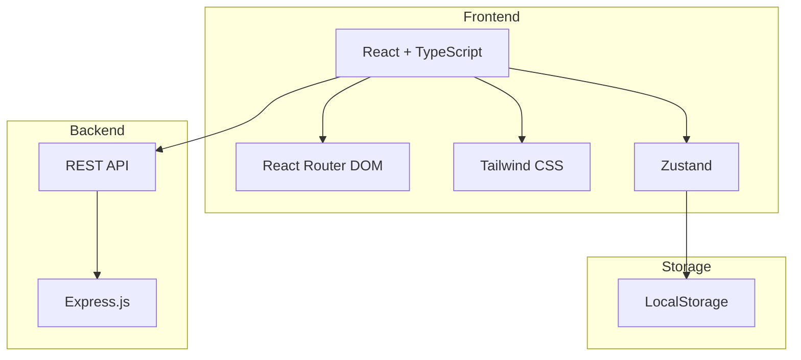
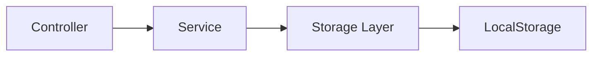
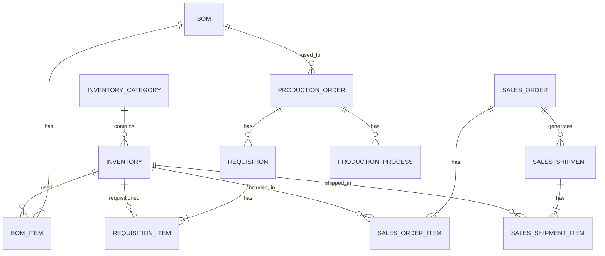

## 1. Architecture Design


## 2. Technology Description
- Frontend: React@18 + TypeScript + tailwindcss@3 + vite
- Initialization Tool: vite-init (react-express-ts template)
- Backend: Express@4
- Database: LocalStorage（用于数据持久化）
- State Management: Zustand

## 3. Route Definitions
| Route | Purpose |
|-------|---------|
| / | 首页/仪表盘 |
| /inventory/category | 存货分类管理 |
| /inventory/list | 存货列表管理 |
| /sales/orders | 销售订单管理 |
| /sales/shipment | 销售出货管理 |
| /bom | BOM表管理 |
| /production/orders | 生产单管理 |
| /production/requisition | 领料单管理 |
| /production/process | 生产工序管理 |

## 4. API Definitions
### 4.1 Type Definitions
```typescript
// 存货分类
interface InventoryCategory {
  id: string;
  name: string;
  description?: string;
  createdAt: string;
  updatedAt: string;
}

// 存货
interface Inventory {
  id: string;
  categoryId: string;
  name: string;
  sku: string;
  unit: string;
  quantity: number;
  price: number;
  description?: string;
  createdAt: string;
  updatedAt: string;
}

// 销售订单
interface SalesOrder {
  id: string;
  orderNo: string;
  customerName: string;
  customerContact?: string;
  items: SalesOrderItem[];
  totalAmount: number;
  status: 'pending' | 'shipped' | 'completed' | 'cancelled';
  createdAt: string;
  updatedAt: string;
}

interface SalesOrderItem {
  inventoryId: string;
  inventoryName: string;
  quantity: number;
  price: number;
  amount: number;
}

// 销售出货
interface SalesShipment {
  id: string;
  shipmentNo: string;
  orderId?: string;
  customerName: string;
  items: SalesShipmentItem[];
  totalQuantity: number;
  shipmentDate: string;
  createdAt: string;
  updatedAt: string;
}

interface SalesShipmentItem {
  inventoryId: string;
  inventoryName: string;
  quantity: number;
}

// BOM表
interface BOM {
  id: string;
  bomNo: string;
  productName: string;
  version: string;
  items: BOMItem[];
  description?: string;
  isActive: boolean;
  createdAt: string;
  updatedAt: string;
}

interface BOMItem {
  inventoryId: string;
  inventoryName: string;
  quantity: number;
  unit: string;
}

// 生产单
interface ProductionOrder {
  id: string;
  orderNo: string;
  bomId?: string;
  productName: string;
  quantity: number;
  status: 'planned' | 'in_progress' | 'completed' | 'cancelled';
  startDate?: string;
  endDate?: string;
  createdAt: string;
  updatedAt: string;
}

// 领料单
interface Requisition {
  id: string;
  requisitionNo: string;
  productionOrderId?: string;
  items: RequisitionItem[];
  status: 'pending' | 'approved' | 'issued' | 'cancelled';
  createdAt: string;
  updatedAt: string;
}

interface RequisitionItem {
  inventoryId: string;
  inventoryName: string;
  quantity: number;
  unit: string;
}

// 生产工序
interface ProductionProcess {
  id: string;
  productionOrderId?: string;
  processName: string;
  sequence: number;
  unitPrice: number;
  workHours: number;
  totalCost: number;
  description?: string;
  createdAt: string;
  updatedAt: string;
}
```

## 5. Server Architecture Diagram


## 6. Data Model
### 6.1 Data Model Definition


### 6.2 Data Storage
使用LocalStorage存储所有数据，键值对结构：
- inventory_categories: InventoryCategory[]
- inventories: Inventory[]
- sales_orders: SalesOrder[]
- sales_shipments: SalesShipment[]
- boms: BOM[]
- production_orders: ProductionOrder[]
- requisitions: Requisition[]
- production_processes: ProductionProcess[]
