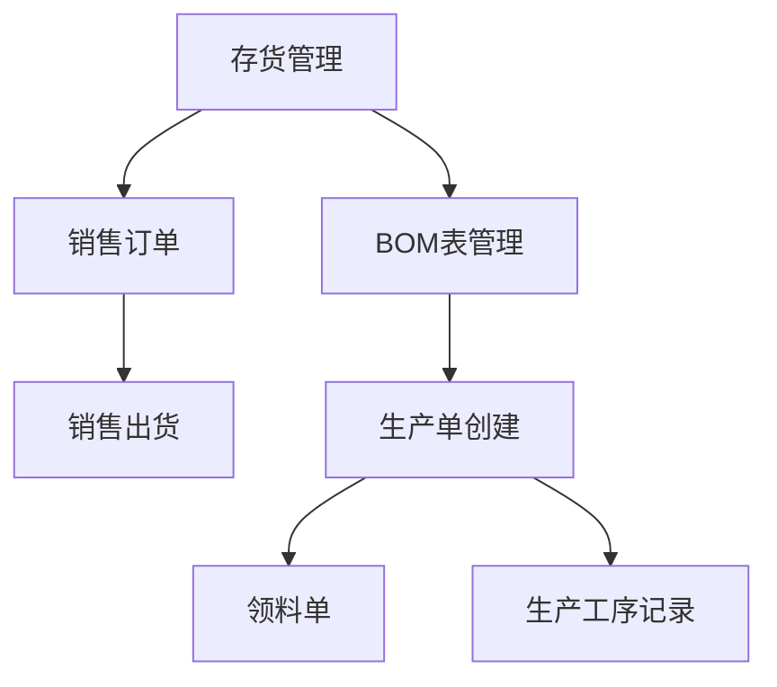

## 1. Product Overview
企业资源计划（ERP）系统，包含存货管理、销售管理、BOM管理和生产管理等核心模块，帮助企业实现业务流程的数字化管理。
- 面向制造企业的中小型ERP系统，解决企业在存货、销售、生产等环节的管理问题
- 目标是提升企业运营效率，降低管理成本，实现业务数据的集中管理和查询

## 2. Core Features

### 2.1 Feature Module
1. **存货模块**：存货分类管理、存货列表管理
2. **销售模块**：订单列表管理、销售出货管理
3. **BOM表模块**：BOM列表管理，支持版本控制
4. **生产模块**：生产单管理、领料单管理、生产工序管理

### 2.3 Page Details
| Page Name | Module Name | Feature description |
|-----------|-------------|---------------------|
| 存货分类 | 存货模块 | 存货分类的增删改查 |
| 存货列表 | 存货模块 | 存货的增删改查、导出、查询功能 |
| 订单列表 | 销售模块 | 订单的增删改查、导出功能 |
| 销售出货 | 销售模块 | 出货记录的增删改查、出货清单导出 |
| BOM列表 | BOM表模块 | BOM的增删改查、单个/全部导出、版本管理 |
| 生产单 | 生产模块 | 生产单的增删改查管理 |
| 领料单 | 生产模块 | 领料单的增删改查管理 |
| 生产工序 | 生产模块 | 生产工序的增删改查、单价工时设置、导出 |

## 3. Core Process
企业用户通过系统管理存货信息，接收销售订单后创建出货记录，基于BOM表制定生产计划，通过生产单和领料单管理生产流程，记录生产工序的工时和成本。

## 4. User Interface Design
### 4.1 Design Style
- 主色调：蓝色系（#2563eb），辅助色：绿色系（#16a34a）
- 按钮风格：圆角矩形，hover状态有阴影效果
- 字体：Inter，14px基础字体
- 布局风格：侧边栏导航+内容区域卡片布局
- 图标风格：使用lucide-react线性图标

### 4.2 Page Design Overview
| Page Name | Module Name | UI Elements |
|-----------|-------------|-------------|
| 存货列表 | 存货模块 | 搜索栏、数据表格、操作按钮、分页 |
| 订单列表 | 销售模块 | 搜索栏、数据表格、操作按钮、分页 |
| BOM列表 | BOM表模块 | 搜索栏、数据表格、版本标签、操作按钮 |
| 生产工序 | 生产模块 | 数据表格、编辑表单、导出按钮 |

### 4.3 Responsiveness
- Desktop-first设计，支持平板和移动设备适配
- 侧边栏在小屏幕设备上可折叠
- 数据表格在小屏幕上支持水平滚动
